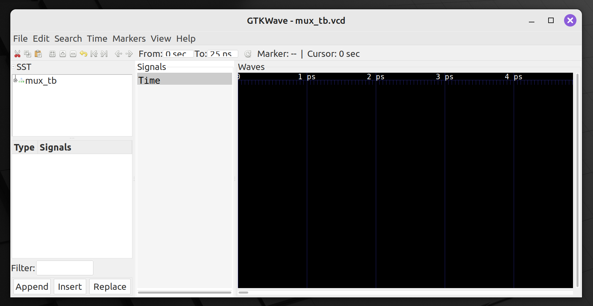
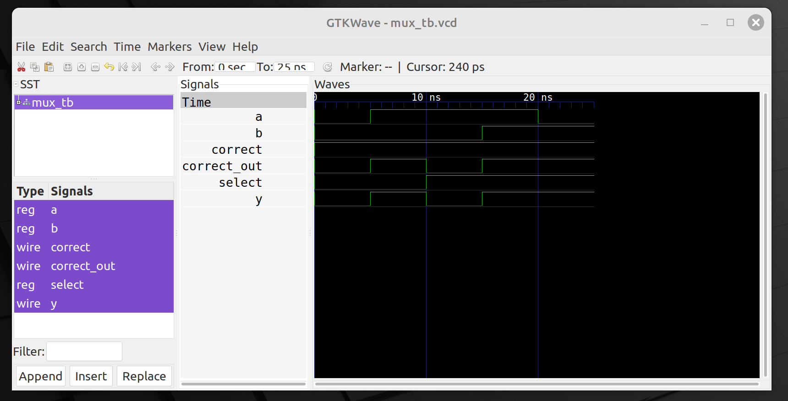
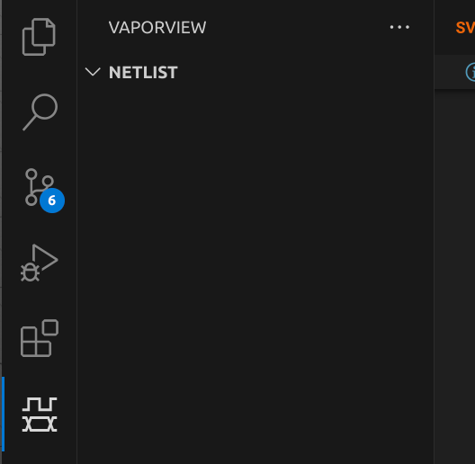
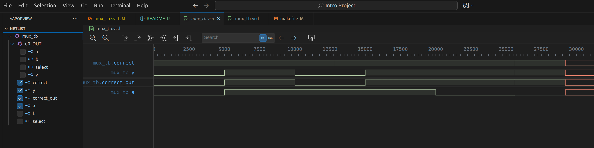

# Welcome to the first mini project! 
This project is meant as a guide to install and setup a local simulation environment for system verilog via Icarus Verilog. Hope you have fun!
## Setup
Before running the makefile, you need to install the following packages:
- Icarus Verilog
- GTKWave (optional)
- Make
### Windows (WSL) / Linux
> Tested on Linux Mint running Ubuntu 20.04 LTS

For windows users, you can install Icarus verilog in WSL for the most up-to-date version without recompiling.There is a  windows version from this website https://bleyer.org/icarus/, but it is not recommended.

To install iverilog on WSL, you can install through the command line:
`sudo apt-get install iverilog`

**(WSL Incompatible) (Optional)** For the wave viewer GTKWave, you can install it through the command line:
`sudo apt-get install gtkwave`
Since WSL is a terminal-only environment, you will not be able to use GTKWave to view the waveforms. However, there are many vscode extensions that can view the waveforms for you. just search for "vcd" in the vscode extension marketplace. 2 of the extensions that I have used are "WaveTrace" and "Vaporview". You can try them out and see which one you like better. (WaveTrace is more user-friendly imo)

### MacOS
> Tested on M3 Macbook Air

For MacOS users, you can install Icarus verilog through homebrew:
`brew install icarus-verilog`
If you have not installed homwbrew, you can install it through the command line:
`/bin/bash -c "$(curl -fsSL https://raw.githubusercontent.com/Homebrew/install/HEAD/install.sh)"`

**(Optional)** For the wave viewer GTKWave, you can install it through homebrew:
`brew install yanjiew1/gtkwave/gtkwave`
> Note: The default gtkwave package on homebrew is not compatible with MacOS 14.0 and above. Use the command above to install the compatible version.
See https://github.com/gtkwave/gtkwave/issues/250

> GTKwave is not tested on Intel-based Mac, if you have one, please let me know if it works.

## Testing
### Simulation
After you have installed all the necessary packages, you can run the makefile to test the installation. A basic multiplexer and its testbench are provided in the project folder.
To run the makefile, you can use the command:
`make run`
Ideally, this would generate the below output:
```terminal
iverilog -g2012 -o simv        -s mux_tb    mux.sv mux_tb.sv
vvp simv       
VCD info: dumpfile mux_tb.vcd opened for output.
@@@ Simulation complete at time   25, all tests passed!
```
If you see that the simulation is complete and all tests passed, then the installation is successful. You can view the waveform using GTKWave or any other waveform viewer that you have installed.
### Waveform Viewing
#### GTKWave
If you have GTKWave installed, you can view the waveform using the command:
`make vcd`
This would compile and run the simulation, and then open the waveform viewer. Something like this should appear:

To view the waves of each wire, you can click on the module Mux_tb and then in the Type Signals section, you will see a list of all the wires in the testbench. You can click on each wire to view the waveform.
You can select some or all of them the click the insert button to view them in the waveform viewer. On the right side in the Signals section, you can see the list of all the signals that you have selected. The Waves section will allow you to view the waveform of the selected signals. (Zoom out to 10 ns scale to see the waveform better)
The resulting waveform should look like this:

> Note for future more complex projects, you might want to save your waveform. In Files-Write Save File, you can save your waveform in a .vcd file. You can then load this file in the future from Files-Read Save File to view the waveform without running the simulation again.
### VSCode Extension (WaveTrace)
This is a much easier method of viewing the waveforms. After installing the extension, just run `make run` and then click on the .vcd file that is generated. The waveform will be displayed in the editor. You can zoom in and out and pan around to view the waveform. You can also click add signals, and double click on the signals to view them in the waveform viewer. The waveform viewer is very user-friendly and easy to use. Unfortunately you cannot save the waveform in this extension, so you will have to choose the signals again if you close the editor.
### VSCode Extension (Vaporview)
Vaporview is more powerfull than wavetrace but is slightly more complex to use. After you install the extension, you should see on your left panel in vscode a new button that has the name vapor view if you hover on it:

Before clicking on it, go to the vcd file tab, then click on the button on vscode, which will open a panel that allows you to select the signal. (You might need to expand the testbench module first to let it show the signals)
After choosing the signals, you will get something like this:

To save/load the waveform, you can right click within the tab (not on any wave), and a menu will appear to allow you to save/load the waveform view for future use.